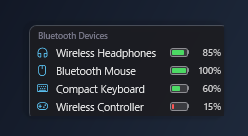

# BTBatteryMonitor

[English](README_en.md) | [日本語](README.md)

A lightweight, transparent desktop widget that displays the battery levels of connected Bluetooth devices in real time on Windows 10/11.

<p align="center">
  
</p>

---

## Features

- **Real-Time Detection**:
  - Hooks OS device change events (`WM_DEVICECHANGE`) to instantly reflect device connections and disconnections on the UI.
  - Zero polling overhead ensures practically **0.0% CPU usage** while idle.
- **Strict Physical Connection Filtering**:
  - Validates active connectivity using official Windows APIs.
  - Paired-but-disconnected devices and powered-off accessories are automatically excluded.
- **Compact Fluent Design**:
  - Translucent smoky-black background (`#D81E1E22`) with rounded corners and borderless styling that blends seamlessly into the desktop.
  - Modern sky-blue category icons (Headphones, Mouse, Keyboard, Gamepad) powered by Segoe Fluent Icons.
  - Horizontal vector battery gauge dynamically resizing based on charge level, with red alert coloring when below 20%.
  - Fully draggable across your desktop.
- **Single Instance Enforcement**:
  - Named mutex guarantees only one background instance runs at a time.
- **Self-Contained Build Environment**:
  - Build and package everything locally without installing global SDKs or compilers on your system.

---

## System Requirements

- **OS**: Windows 10 (Build 19041 or higher) / Windows 11 (x64)
- **Bluetooth**: Bluetooth 4.0 or higher (supports both BLE and Classic Bluetooth)

---

## Installation

### Method 1: Installer (Recommended)
1. Download the latest `BTBatteryMonitor_Setup.exe` from [Releases](https://github.com/DT-AIRA/BTBatteryMonitor/releases).
2. Run the installer and follow the setup wizard (Administrator privileges are not required).
3. Optionally select "Launch at Windows startup" to have it run automatically in the background.
4. Clean uninstallation is available anytime via Windows Settings > Installed apps or Control Panel.

### Method 2: Portable
1. Download `BTBatteryMonitor.exe` from [Releases](https://github.com/DT-AIRA/BTBatteryMonitor/releases).
2. Place it in any directory and double-click to launch.

---

## Usage

- **Move Widget**: Left-click and drag anywhere on the widget to reposition it on your desktop.
- **Right-Click Context Menu**:
  - **Always on Top**: Toggle pinning the widget above all other windows (state reflected with a checkmark).
  - **Refresh**: Manually force-refresh battery levels.
  - **Exit**: Exit the application.

---

## Build & Development

The repository includes helper scripts to bootstrap and build locally without global dependencies:

```bat
# 1. Setup local environment (.NET 8 SDK downloaded locally into tools/)
setup_env.bat

# 2. Build the project
build.bat

# 3. Run debug build
run.bat

# 4. Create release artifacts (Self-contained Single EXE + Inno Setup installer)
publish.bat
```
- The standalone single executable will be generated at `publish\BTBatteryMonitor.exe`.
- The installer will be generated at `dist\BTBatteryMonitor_Setup.exe`.

---

## Architecture & Tech Stack

- **UI Framework**: WPF (.NET 8 Windows Desktop / x64)
- **Windows APIs**:
  - `setupapi.dll` (Win32 PnP Property Query: Direct read of Classic Bluetooth / Hands-Free audio battery property `{104EA319...} 2`)
  - `Windows.Devices.Enumeration` & `Windows.Devices.Bluetooth` (WinRT: BLE AEP battery query and connection validation)
  - `HwndSource` / `WM_DEVICECHANGE` (Event-driven real-time updates via Windows message hook)
- **Packaging**: Inno Setup 6 (driven by portable local compiler)

---

## License

Copyright (c) 2026 DT-AIRA

Distributed under the [Apache License, Version 2.0](LICENSE).
